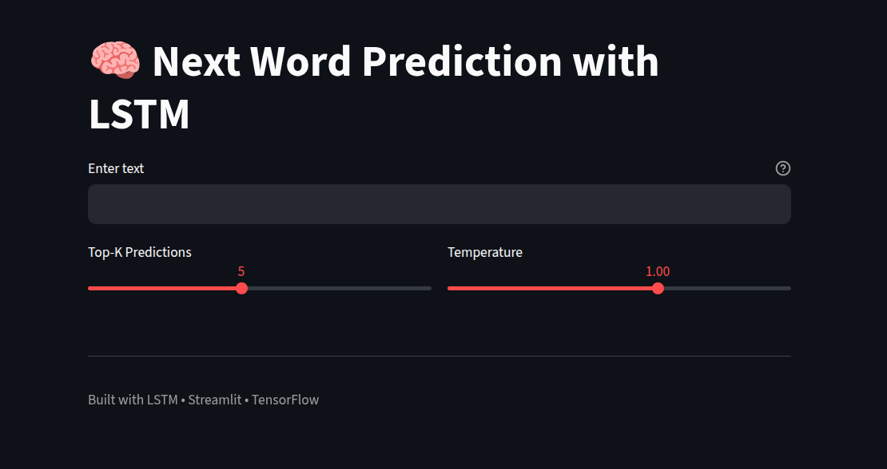
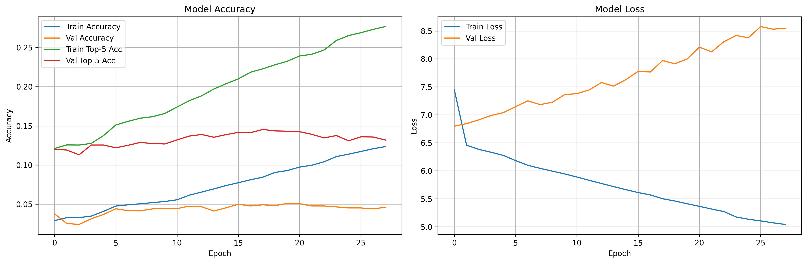

# 🧠 Next Word Prediction with LSTM

A professional deep learning project that predicts the next word in a sequence using **Long Short-Term Memory (LSTM)** networks. Trained on the timeless literature of Shakespeare's _"Hamlet"_, this application demonstrates the power of Recurrent Neural Networks (RNNs) in Natural Language Processing (NLP).

---

## 🚀 App Preview

The project includes an interactive **Streamlit** web application where users can input text and get real-time predictions with adjustable parameters.


_Interactive Streamlit interface for next word prediction._

---

## ✨ Key Features

- **LSTM-based Deep Learning**: Utilizes a robust LSTM architecture to capture long-range dependencies in text.
- **Interactive UI**: A sleek Streamlit dashboard for real-time inference.
- **Top-K Predictions**: View multiple potential next words with their associated confidence scores.
- **Temperature Scaling**: Adjust the "creativity" or randomness of the model's predictions via a slider.
- **Shakespearean Context**: Specifically trained for stylistic consistency with classical literature.

---

## 📊 Model Performance

The model was trained with early stopping to ensure optimal convergence without overfitting. Below is the training history showing accuracy and loss across epochs.


_Training and Validation Accuracy/Loss curves._

---

## 🛠️ Technical Stack

- **Core**: Python
- **Deep Learning**: TensorFlow, Keras
- **Web App**: Streamlit
- **Data Handling**: NumPy, Pandas
- **NLP Utilities**: Natural Language Toolkit (NLTK)
- **Serialization**: Pickle

---

## 🏗️ Model Architecture

The model is built using a sequential API with the following layers:

1. **Embedding Layer**: Converts word indices into dense vectors of fixed size.
2. **LSTM Layers**: Two stacked LSTM layers (256 units each) with `recurrent_dropout`.
3. **Dense Layers**: A 512-unit dense layer with ReLU activation and L2 regularization.
4. **Output Layer**: Softmax activation to predict probabilities over the entire vocabulary.

---

## 📂 Project Structure

```text
.
├── app.py                # Streamlit web application
├── experiemnts.ipynb     # Jupyter notebook for training and evaluation
├── hamlet.txt            # Raw dataset
├── next_word_lstm.h5     # Trained model weights
├── tokenizer.pickle      # Serialized tokenizer object
├── requirements.txt      # Project dependencies
├── images/               # Visual assets for documentation
│   ├── app.png
│   └── training_history.png
└── README.md             # Project documentation
```

---

## 🔧 Setup & Installation

Follow these steps to run the project locally:

1. **Clone the repository**:

   ```bash
   git clone <repository-url>
   cd simple_rnn_imdb
   ```

2. **Create and activate a virtual environment**:

   ```bash
   python -m venv venv
   source venv/bin/activate  # On Windows: venv\Scripts\activate
   ```

3. **Install dependencies**:

   ```bash
   pip install -r requirements.txt
   ```

4. **Run the Streamlit app**:
   ```bash
   streamlit run app.py
   ```

---

## 📈 Future Improvements

- [ ] Support for larger datasets to improve vocabulary range.
- [ ] Implementation of Transformer-based models (like BERT or GPT layers).
- [ ] Multi-word sequence prediction.
- [ ] Integration with more diverse writing styles.

---

_Built with ❤️ using TensorFlow & Streamlit._
